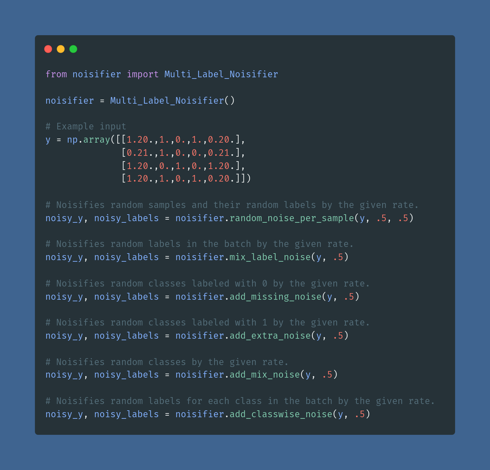

# noisifier

noisifier is a simple, yet effective python library. 

noisifier allows you to add noise to the labels of your dataset. You can use the noisified dataset in your experiments, also to train your machine learning model robustly against label noise.

Your dataset can be single label or multi-label; just create the right type of noisifier and keep adding noise.


## Prerequisites

python 3.8.5 

numpy 1.19.2

## Installation

```
pip install noisifier
```

## Link to the project 

https://pypi.org/project/noisifier/

## How to Use

Convert your Tensorflow or PyTorch tensors into numpy arrays with ```tensor.numpy()```, or load a numpy array.
The output will be numpy array. Convert to tensorflow tensor with ```tf.convert_to_tensor(y)``` and to PyTorch tensor with ```torch.from_numpy(y)```.





## Caveats

Provide the input in one-hot encoded form. If you use keras, you can do that by 

```
y = keras.utils.to_categorical(y, number_of_classes)
```

Use a float between 0. and 1. for all the noise rates.

## Tests

To run all the tests:

```
python -m unittest discover test
```

To run partial test:

```
python -m unittest test.test_multi_label
```

## Licence

noisifier is released under the MIT licence.

## Version 

0.4.6
